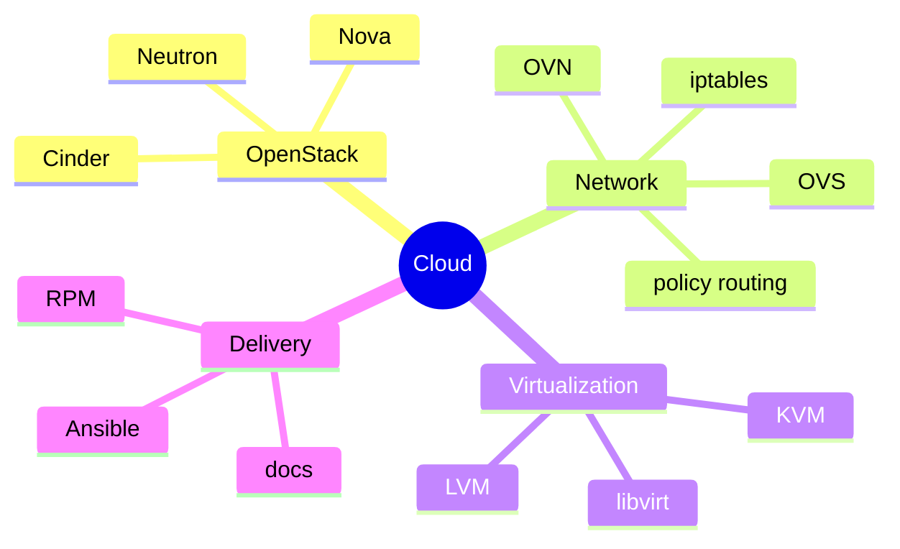

<div align="center">


# Hi，我是王坤田

## 一个长期和云、网络、虚拟化打交道的工程师

我喜欢研究复杂系统背后的运行逻辑，也喜欢把踩过的坑整理成可以复用的方案。  
现在主要在做 OpenStack、云平台、虚拟网络、宿主机 Agent 和自动化工具相关的事情。


<p>
  <a href="mailto:wangkuntian1994@163.com">
    
  </a>
  <a href="https://www.littlemoon.vip/">
    
  </a>
  <a href="https://github.com/wangkuntian">
    
  </a>
</p>

</div>

---

## 关于我

如果用几句话介绍我，大概是这样：

- 白天和云平台、网络转发、虚拟化、存储、Agent 打交道。
- 遇到问题时，喜欢从日志、抓包、路由表、iptables、OVS / OVN 流表一路追到根因。
- 写代码之外，也喜欢写文档：方案、排障记录、技术调研、踩坑复盘都算。
- 相比“看起来很酷”的实现，我更偏爱能上线、能维护、能解释清楚的方案。

---

## 我常玩的技术地图

<p>
  
  
  
  
  
  
  
  
  
  
  
</p>

```text
Cloud Platform    OpenStack / Nova / Neutron / Cinder / Kolla-ansible
Cloud Network     L3 HA / DVR / Floating IP / Security Group / IPv6
Virtualization    KVM / QEMU / libvirt / LVM / VGPU / Windows Adaptation
Automation        Python / Shell / Ansible / FastAPI / Flask / Django
Exploring         Rust / Go / Axum / Agent / HostStack / vNet
```

---

## 最近比较着迷的方向



---

## 做过一些有意思的事

### 让 OpenStack 网络流量不再挤在一个点上

在有栈云平台里做过虚拟机出入网和浮动 IP 端口映射场景的流量分散：兼容 L3 HA 和 DVR，同时把网络节点的热点压力拆开。这个特性后来进入 openEuler OpenStack SIG，并纳入 openEuler 20.03 LTS SP4 和 22.03 LTS SP3。

[看看这份官方文档](https://openstack-sig.readthedocs.io/zh/latest/spec/distributed-traffic/)

### 把虚拟网络、容器和宿主机流量串起来

做过 HostStack / vNet 虚拟网络相关能力，参与子网、端口、安全组、虚拟网络异步化等接口建设。也处理过 ARM 容器代理分流，把代理能力从容器内迁移到宿主机，通过 `iptables`、策略路由和 `tun` 完成流量导流。

### 给宿主机 Agent 补齐虚拟化和存储能力

围绕宿主机侧 Agent 建设过卷管理、磁盘管理、镜像管理、应用同步、系统盘创建等接口。也落地过基于 LVM 的存储虚拟化方案，并处理 VGPU、Windows 适配、KVM 迁移脚本等实际场景。

<details>
<summary><strong>再展开一点点</strong></summary>

- 做过 MySQL / Redis 云数据库高可用能力，包括镜像制作、故障检测和自动迁移。
- 做过云平台监控告警优化，把监控数据从 MySQL 压力点迁移到更合适的存储链路。
- 修过 DVR 部署模式下端口转发固定比例丢包问题，最后定位到计算节点 `qrouter` 命名空间里的 SNAT 规则异常。
- 参与 openEuler OpenStack SIG，做过版本移植、文档编写和社区协作。
- 参加 openEuler Summit 2023，做过 OpenStack 相关技术分享。

</details>

---

## 我的工程偏好

| 我喜欢 | 因为 |
| --- | --- |
| 可解释的架构 | 出问题时能快速定位，而不是靠猜 |
| 小步验证 | 复杂系统里，证据比直觉可靠 |
| 文档沉淀 | 让下一次排障少走弯路 |
| 朴素实现 | 能长期维护的代码，才是真的酷 |

---

## GitHub 小窗口

<div align="center">


</div>

---

## 找到我

- Blog：<https://www.littlemoon.vip/>
- Email：<wangkuntian1994@163.com>
- GitHub：<https://github.com/wangkuntian>

---

<div align="center">

**愿每一条奇怪的网络路径，最后都能被解释清楚。**

</div>
