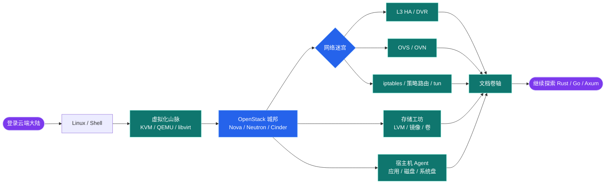
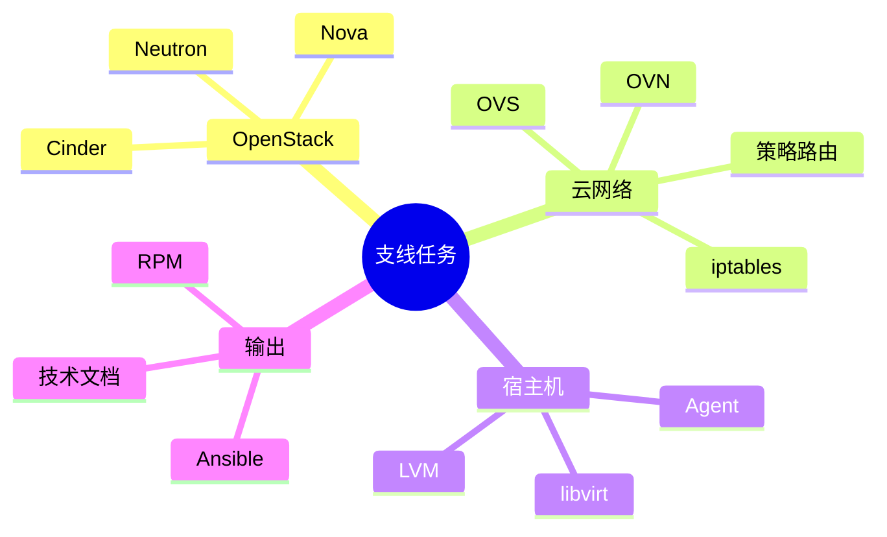

<div align="center">


# Hi，我是王坤田

## 一个长期和云、网络、虚拟化打交道的工程师

我喜欢研究复杂系统背后的运行逻辑，也喜欢把踩过的坑整理成可以复用的方案。  
现在主要在做 OpenStack、云平台、虚拟网络、宿主机 Agent 和自动化工具相关的事情。


<p>
  <a href="mailto:wangkuntian1994@163.com">
    
  </a>
  <a href="https://www.littlemoon.vip/">
    
  </a>
  <a href="https://github.com/wangkuntian">
    
  </a>
</p>

</div>

---

## 今日人设

<table>
  <tr>
    <td><strong>职业</strong></td>
    <td>云网络系调试师</td>
  </tr>
  <tr>
    <td><strong>武器</strong></td>
    <td>日志、抓包、路由表、iptables、OVS / OVN 流表</td>
  </tr>
  <tr>
    <td><strong>技能</strong></td>
    <td>把“偶现问题”逼到稳定复现，把“玄学网络”翻译成人话</td>
  </tr>
  <tr>
    <td><strong>状态</strong></td>
    <td>咖啡因驱动中，文档同步生成中</td>
  </tr>
</table>

```text
       (￣▽￣)ノ   Cloud Network Debugger is online
       /|    |    今日也在把玄学问题变成已知问题
        |____|
```

---

## 关于我

如果用几句话介绍我，大概是这样：

- 白天和云平台、网络转发、虚拟化、存储、Agent 打交道。
- 遇到问题时，喜欢从日志、抓包、路由表、iptables、OVS / OVN 流表一路追到根因。
- 写代码之外，也喜欢写文档：方案、排障记录、技术调研、踩坑复盘都算。
- 相比“看起来很酷”的实现，我更偏爱能上线、能维护、能解释清楚的方案。

---

## 云端冒险地图

<p>
  
  
  
  
  
  
  
  
  
  
  
</p>



---

## 最近的支线任务



---

## 工程偏好卡组

<p>
  
  
  
  
</p>

> ### SSR 可解释架构
> 出问题时能一路查到根因，而不是开会研究“它为什么突然好了”。
>
> ### SR 小步验证
> 复杂系统里，证据比直觉可靠；能复现的问题已经赢了一半。
>
> ### SR 文档沉淀
> 今天写一页排障记录，明天少一次深夜怀疑人生。
>
> ### R 朴素实现
> 能长期维护的代码，才是真的酷；炫技不如稳定上线。

---

## GitHub 小窗口

<div align="center">


</div>

---

## 找到我

- Blog：<https://www.littlemoon.vip/>
- Email：<wangkuntian1994@163.com>
- GitHub：<https://github.com/wangkuntian>

---

<div align="center">

**不要把所有问题都归咎于网络，虽然它经常看起来很可疑。**

</div>
