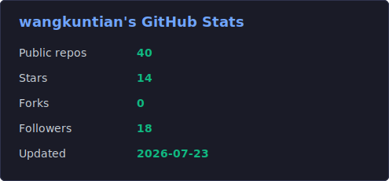
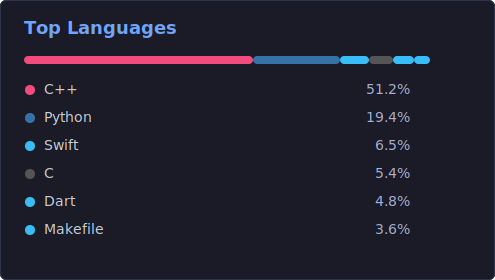
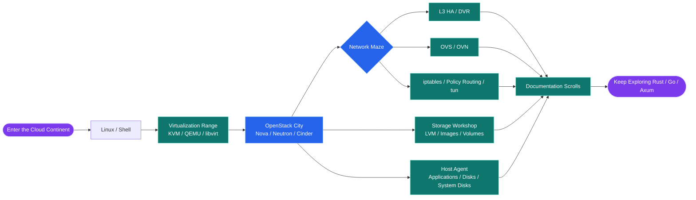
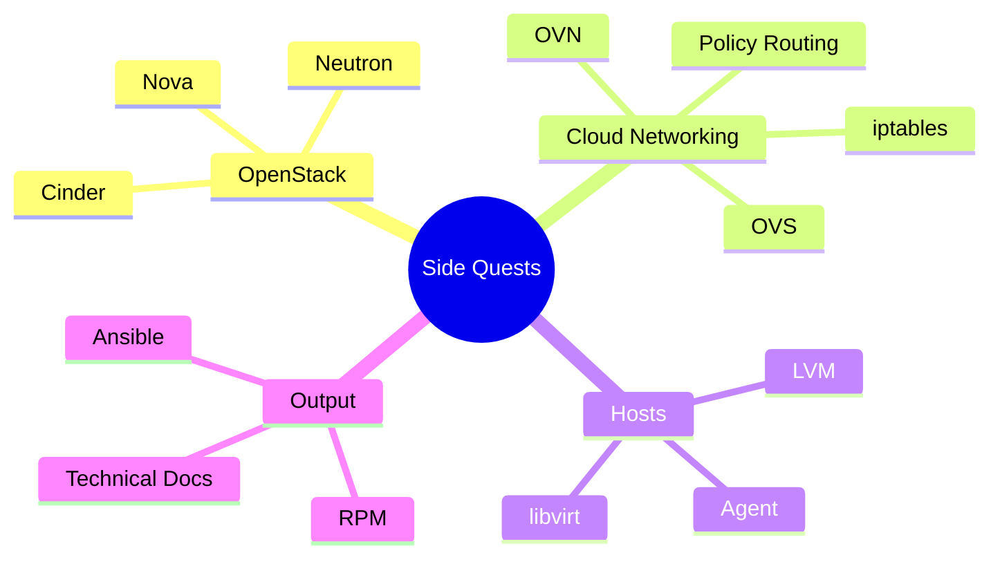

<div align="center">


# Hi, I'm Wang Kuntian

## An engineer who spends long days with cloud, networking, and virtualization

I like digging into how complex systems work, and I like turning hard-won lessons into reusable solutions.  
These days, I mainly work on OpenStack, cloud platforms, virtual networking, host agents, and automation tooling.


<p>
  <a href="mailto:wangkuntian1994@163.com">
    
  </a>
  <a href="https://www.littlemoon.vip/">
    
  </a>
  <a href="https://github.com/wangkuntian">
    
  </a>
</p>





</div>

---

## Today's Build

<table>
  <tr>
    <td><strong>Role</strong></td>
    <td>Cloud network debugger</td>
  </tr>
  <tr>
    <td><strong>Tools</strong></td>
    <td>Logs, packet captures, routing tables, iptables, OVS / OVN flows</td>
  </tr>
  <tr>
    <td><strong>Skill</strong></td>
    <td>Turning intermittent issues into stable reproductions, and translating mysterious networking into plain language</td>
  </tr>
  <tr>
    <td><strong>Status</strong></td>
    <td>Caffeine-powered, with documentation generated alongside the fix</td>
  </tr>
</table>

```text
       (￣▽￣)ノ   Cloud Network Debugger is online
       /|    |    Turning mysterious issues into known issues
        |____|
```

---

## About Me

In a few lines:

- I work with cloud platforms, network forwarding, virtualization, storage, and host agents.
- When something breaks, I trace it through logs, packets, routing tables, iptables, and OVS / OVN flows until the root cause shows up.
- Outside code, I also write documents: designs, troubleshooting notes, technical research, and postmortems.
- I prefer solutions that can ship, be maintained, and be explained clearly over implementations that only look clever.

---

## Cloud Adventure Map

<p>
  
  
  
  
  
  
  
  
  
  
  
</p>



---

## Recent Side Quests



---

## Engineering Preference Cards

<p>
  
  
  
  
</p>

> ### SSR Explainable Architecture
> When something fails, the path to the root cause should be traceable, not something that needs a meeting titled "why did it suddenly recover?"
>
> ### SR Small Verified Steps
> In complex systems, evidence beats instinct; a reproducible issue is already half solved.
>
> ### SR Documented Learning
> One troubleshooting note today can save one late-night spiral tomorrow.
>
> ### R Plain Implementation
> Code that can be maintained for years is the kind that is truly cool; shipping stable systems beats showing off.

---

## Contribution Snake

<div align="center">

<picture>
  <source media="(prefers-color-scheme: dark)" srcset="https://raw.githubusercontent.com/wangkuntian/wangkuntian/output/github-contribution-grid-snake-dark.svg" />
  <source media="(prefers-color-scheme: light)" srcset="https://raw.githubusercontent.com/wangkuntian/wangkuntian/output/github-contribution-grid-snake.svg" />
  
</picture>

</div>

---

## Find Me

- Blog: <https://www.littlemoon.vip/>
- Email: <wangkuntian1994@163.com>
- GitHub: <https://github.com/wangkuntian>

---

<div align="center">

**Do not blame every problem on the network, even though it often looks suspicious.**

</div>
