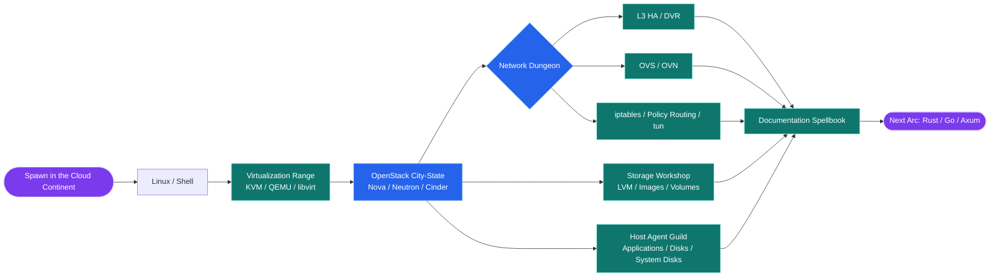
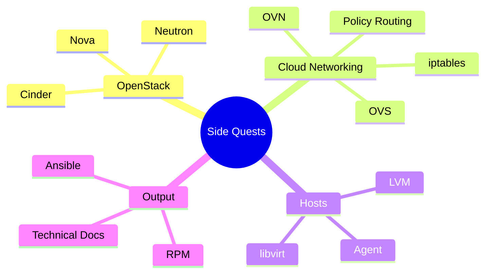

<div align="center">


<picture>
  <source media="(prefers-color-scheme: dark)" srcset="https://raw.githubusercontent.com/wangkuntian/wangkuntian/output/github-contribution-grid-snake-dark.svg" />
  <source media="(prefers-color-scheme: light)" srcset="https://raw.githubusercontent.com/wangkuntian/wangkuntian/output/github-contribution-grid-snake.svg" />
  
</picture>

# Hi, I'm Wang Kuntian

## Cloud network engineer by day, infrastructure anime protagonist by build log

I hunt cloud-network bugs until they drop loot, then turn the battle notes into docs the next engineer can actually use.  
Current arc: OpenStack, virtual networking, host agents, automation tooling, and the occasional "why is the packet doing parkour?" episode.


<p>
  <a href="mailto:wangkuntian1994@163.com">
    
  </a>
  <a href="https://www.littlemoon.vip/">
    
  </a>
  <a href="https://github.com/wangkuntian">
    
  </a>
</p>

<p>
  
  
</p>

</div>

---

## Character Sheet

<table>
  <tr>
    <td><strong>Role</strong></td>
    <td>Cloud network debugger, packet whisperer, incident side-quest enjoyer</td>
  </tr>
  <tr>
    <td><strong>Loadout</strong></td>
    <td>Logs, packet captures, routing tables, iptables, OVS / OVN flows</td>
  </tr>
  <tr>
    <td><strong>Special Move</strong></td>
    <td>Turning "it only happens sometimes" into a boring, repeatable failure with receipts</td>
  </tr>
  <tr>
    <td><strong>Status Effect</strong></td>
    <td>Caffeinated, mildly over-leveled in tcpdump, documentation auto-summoned after combat</td>
  </tr>
</table>

```text
       (￣▽￣)ノ   Cloud Network Debugger: online
       /|    |    Plot armor: disabled. Packet capture: enabled.
        |____|
```

---

## About Me

Short version:

- I build and debug cloud platforms, network forwarding paths, virtualization layers, storage plumbing, and host agents.
- When a system starts acting haunted, I follow the logs, packets, routes, iptables rules, and OVS / OVN flows until the mystery loses its dramatic lighting.
- I write code, but I also write the trail map: designs, troubleshooting notes, research writeups, and postmortems.
- Flashy tech is fun; boring, shippable, explainable systems are the real final boss clear.

---

## Cloud Adventure Map

<p>
  
  
  
  
  
  
  
  
  
  
  
</p>



---

## Recent Side Quests



---

## Engineering Preference Cards

<p>
  
  
  
  
</p>

> ### SSR Explainable Architecture
> If production starts yelling, the root-cause trail should be clear enough to follow without a twelve-person mystery council.
>
> ### SR Small Verified Steps
> In complex systems, evidence beats vibes. A reproducible bug has already lost half its health bar.
>
> ### SR Battle Tested Docs
> One solid troubleshooting note today saves one future engineer from dramatic 2 a.m. monologues.
>
> ### R Boring Code Wins
> Clever code gets applause. Boring code gets paged less. I know which ending I prefer.

<div align="center">

---

### Final Boss Rule

**Comments are like side quests: essential lore, somehow always skipped.**

</div>
